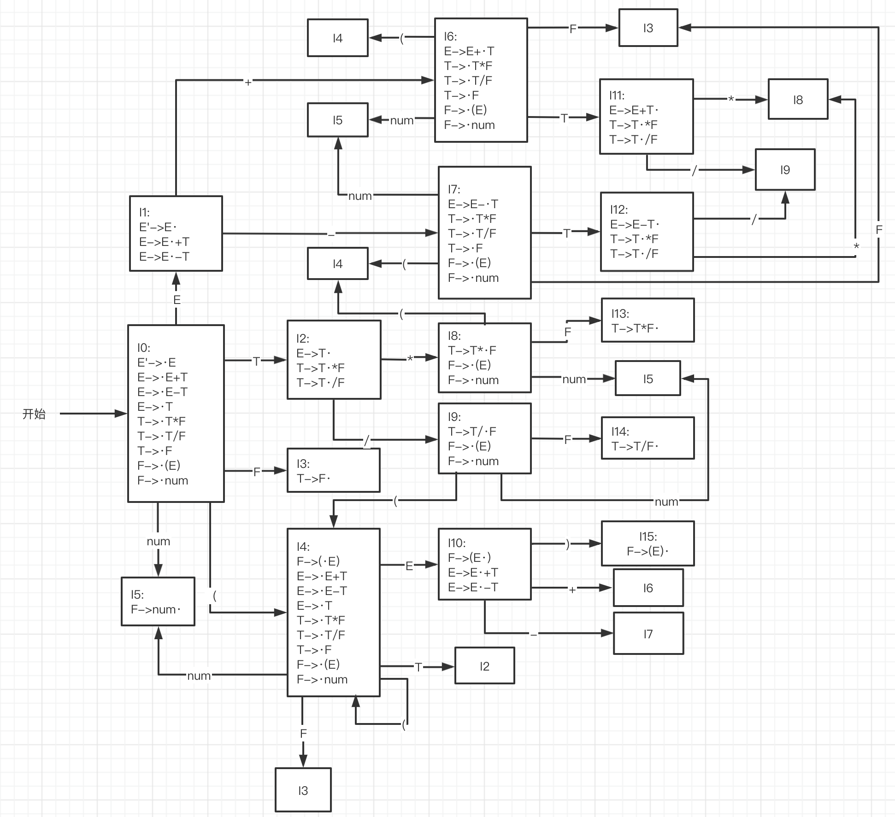
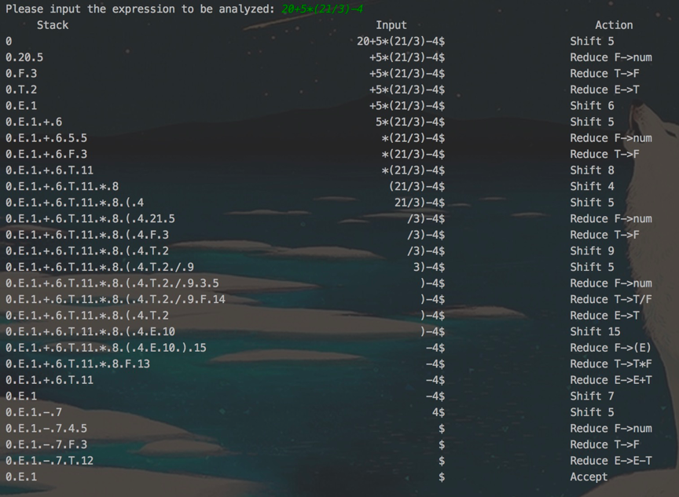
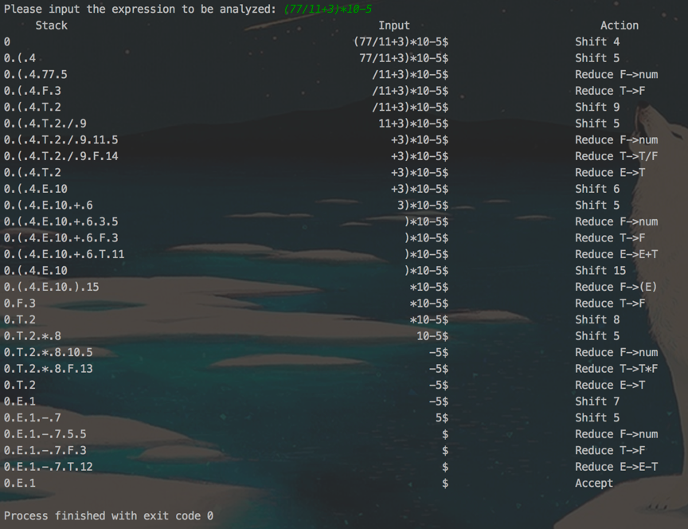
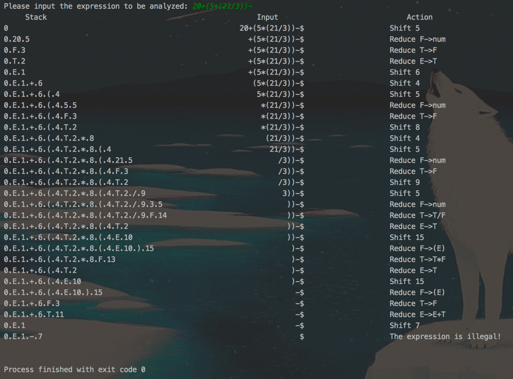
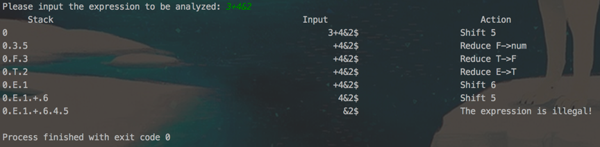

本文的前提：  
编写语法分析程序，实现对算术表达式的语法分析。要求所分析算数表达式由如下的文法产生

> E->E+T | E-T | T
>
> T->T\*F | T/F | F
>
> F-> (E) | num

实验要求：在对输入的算术表达式进行分析的过程中，依次输出所采用的产生式  
编写算法分析程序实现自底向上的分析，要求如下  
(1)构造识别该文法所有活前缀的DFA  
(2)构造该文法的LR分析表  
(3)编程实现算法4.3，构造LR分析程序  

## 分析

首先，对于给出的文法，写出其拓广文法：

> (0) E'->E  
> (1) E->E+T  
> (2) E->E-T  
> (3) E->T  
> (4) T->T\*F  
> (5) T->T\/F  
> (6) T->F  
> (7) F-> (E)  
> (8) F->num

构造如下的识别该文法所有活前缀的DFA：  
  
同时写出相应的FOLLOW集：  
> follow(E') = { $ }  
> follow(E) = { +, -, ), $ }  
> follow(T) = follow(F) = { *, /, +, -, ), $ }

然后，根据构造的DFA和FOLLOW集，可以填出对应的LR分析表：

-- | + | - | * | / | ( | ) | num | $ | E | T | F
--|--|--|--|--|--|--|--|--|--|--|--
0 | | | | | s4 | | s5 | | 1 | 2 | 3
1 | s6 | s7 | | | | | | acc | | |
2 | r3 | r3 | s8 | s9 | | r3 | | r3 | |
3 | r6 | r6 | r6 | r6 | | r6 | | r6 | | |
4 | | | | | s4 | | s5 | | 10 | 2 | 3
5 | r8 | r8 | r8 | r8 | | r8 | | r8 | | |
6 | | | | | s4 | | s5 | | | 11 | 3
7 | | | | | s4 | | s5 | | | 12 | 3
8 | | | | | s4 | | s5 | | | | 13
9 | | | | | s4 | | s5 | | | | 14
10 | s6	| s7 |	| | | s15 | | | | |
11 | r1	| r1 | s8 | s9 | | r1 | | r1 | | |
12 | r2	| r2 | s8 | s9 | | r2 | | r2 | | |
13 | r4	| r4 | r4 | r4 | | r4 | | r4 | | |
14 | r5	| r5 | r5 | r5 | | r5 | | r5 | | |
15 | r7	| r7 | r7 | r7 | | r7 | | r7 | | |

最后实现算法4.3，其伪代码如下：  
```nohighlight
输入：文法G的一张分析表和一个输入符号串ω  
输出：若ω∈L(G)，得到ω的自底向上的分析，否则报错  
方法：开始时，初始状态S0在栈顶，ω$在输入缓冲器中  

置ip指向ω$的第一个符号；  
   repeat  forever   begin  
   令S是栈顶状态，a是ip所指向的符号；  
   if action[S，a]=shift S’  then  begin  
      把a和S’依次入栈；  
      推进ip，使它指向下一个输入符号  
      end  
   else if action[S，a]=reduce by A→β  then  begin  
      从栈顶弹出2*|β|个符号；      
      令S’是现在的栈顶状态，把A和goto[S’，A]入栈；  
      输出产生式A→β  
      end  
   else if action[S，a]=accept  then  return  
   else  error()  
end.  
```

## 实现

在具体的实现中，我定义了两个结构体，分别用来表示产生式和action表。  
```cpp
struct generator{
    char left; //产生式左边的符号，即非终结符
    vector<string> right; //产生式右边的短语，使用vector<string>容器存储，因为一个非终结符可能产生多个短语
};

struct action{
    char para; //para有四种可能，'s'代表shift，'r'代表reduce，'a'代表accept，'-'代表NULL
    int val; //如果para为's'，则val代表应该转移的状态；如果para为'r'，则val代表规约所使用的产生式；val=-1时代表NULL
};
```
然后将action表和goto表初始化如下  
```cpp
action action[16][8]={
        {{'-',-1},{'-',-1},{'-',-1},{'-',-1},{'s',4},{'-',-1},{'s',5},{'-',-1}},
        {{'s',6},{'s',7},{'-',-1},{'-',-1},{'-',-1},{'-',-1},{'-',-1},{'a',-1}},
        {{'r',3},{'r',3},{'s',8},{'s',9},{'-',-1},{'r',3},{'-',-1},{'r',3}},
        {{'r',6},{'r',6},{'r',6},{'r',6},{'-',-1},{'r',6},{'-',-1},{'r',6}},
        {{'-',-1},{'-',-1},{'-',-1},{'-',-1},{'s',4},{'-',-1},{'s',5},{'-',-1}},
        {{'r',8},{'r',8},{'r',8},{'r',8},{'-',-1},{'r',8},{'-',-1},{'r',8}},
        {{'-',-1},{'-',-1},{'-',-1},{'-',-1},{'s',4},{'-',-1},{'s',5},{'-',-1}},
        {{'-',-1},{'-',-1},{'-',-1},{'-',-1},{'s',4},{'-',-1},{'s',5},{'-',-1}},
        {{'-',-1},{'-',-1},{'-',-1},{'-',-1},{'s',4},{'-',-1},{'s',5},{'-',-1}},
        {{'-',-1},{'-',-1},{'-',-1},{'-',-1},{'s',4},{'-',-1},{'s',5},{'-',-1}},
        {{'s',6},{'s',7},{'-',-1},{'-',-1},{'-',-1},{'s',15},{'-',-1},{'-',-1}},
        {{'r',1},{'r',1},{'s',8},{'s',9},{'-',-1},{'r',1},{'-',-1},{'r',1}},
        {{'r',2},{'r',2},{'s',8},{'s',9},{'-',-1},{'r',2},{'-',-1},{'r',2}},
        {{'r',4},{'r',4},{'r',4},{'r',4},{'-',-1},{'r',4},{'-',-1},{'r',4}},
        {{'r',5},{'r',5},{'r',5},{'r',5},{'-',-1},{'r',5},{'-',-1},{'r',5}},
        {{'r',7},{'r',7},{'r',7},{'r',7},{'-',-1},{'r',7},{'-',-1},{'r',7}}
};

int go_to[16][3]={
        {1,2,3},
        {0,0,0},
        {0,0,0},
        {0,0,0},
        {10,2,3},
        {0,0,0},
        {0,11,3},
        {0,12,3},
        {0,0,13},
        {0,0,14},
        {0,0,0},
        {0,0,0},
        {0,0,0},
        {0,0,0},
        {0,0,0},
        {0,0,0}
};
```
然后定义`init()`函数，将产生式初始化如下：  
```cpp
void init() {
    E.left = 'E';
    E.right.push_back("E+T"); //产生式编号为1
    E.right.push_back("E-T"); //产生式编号为2
    E.right.push_back("T"); //产生式编号为3
    T.left = 'T';
    T.right.push_back("T*F"); //产生式编号为4
    T.right.push_back("T/F"); //产生式编号为5
    T.right.push_back("F"); //产生式编号为6
    F.left = 'F';
    F.right.push_back("(E)"); //产生式编号为7
    F.right.push_back("num"); //产生式编号为8
}
```
同时定义一个`convert()`函数，其作用是接受一个字符，返回该字符在LR分析表中所对应的列：  
```cpp
int convert(char ch){
    switch(ch){
        case '+': return 0;
        case '-': return 1;
        case '*': return 2;
        case '/': return 3;
        case '(': return 4;
        case ')': return 5;
        case 'i': return 6; //使用i来表示num
        case '$': return 7;
        default: return -1; //无该符号，说明输入的算术表达式不合法
    }
}
```
在主体的`analyze()`函数中，定义三个stack  
```cpp
    stack<int> state; //状态栈
    stack<string> symbol; //符号栈
    stack<char> input; //输入缓冲区
```
然后开始循环分析输入的字符串，使用bool变量来控制循环的结束  
```cpp
bool flag = false; //标志分析是否结束
while (!flag) { //当分析未结束时
......
}
```
对于字符串中的数字，作如下处理：  
```cpp
        char ch = input.top(); //获取输入缓冲区的栈顶符号
        if (ch >= '0' && ch <= '9') {
            string num;
            while (ch >= '0' && ch <= '9') { //如果是多个数字
                num.push_back(ch);
                input.pop();
                ch = input.top();
            }
            symbol.push(num); //将数字压栈
            ch = 'i'; //将类型标记为数字类型
        }
```
然后将`ch`传给`convert()`函数，获得action表对应的列，通过查action表即可得知当前动作：  
```cpp
Int col = convert(ch); //判断栈顶符号在action表中的哪一列
int row = state.top(); //判断当前所处的状态（在action表中的哪一行）
if (col == -1) { //如果无该符号，说明输入的表达式不合法，输出提示语句并退出循环
    cout << "The expression is illegal!" << endl;
    break;
}
struct action a = action[row][col]; //查action表获取当前动作
```
对于获得到的`action a`，其属性`a.para`有四种结果，分别对应四种操作：  
```cpp
if (a.para == 's') { //如果是移进
......
state.push(a.val); //将下一个状态压进状态栈
            if (ch != 'i') { //如果缓冲区栈顶不是数字的话
                string buffer = " ";
                buffer[0] = ch;
                symbol.push(buffer); //将缓冲区符号压栈（即移进操作）
                input.pop();
            }
//是数字的情况，在前面对数字作处理时已经压进栈了，所以不必再做处理
} else if (a.para == 'r') { //如果是规约
int i = a.val; //获得产生式的编号
if (i >= 1 && i <= 3) { //如果是E推导出的产生式
for (int j = 0; j < E.right[i - 1].length(); j++) { //从栈顶弹出2|β|个符号
    state.pop();
    symbol.pop();
}

buffer[0] = E.left;
symbol.push(buffer); //将E压栈
state.push(go_to[state.top()][0]);
//其他的情况与上面类似，在此不作列出
} else if (a.para == 'a') { //分析完成
    cout << left << setw(20) << "Accept";
    flag = true; //更改flag，退出循环
} else if (a.para == '-') { //无该字符，输出提示语句
    cout << "The expression is illegal!" << endl;
    flag = true; //更改flag，退出循环
}
```

至此，分析完成。  

## 测试

输入几个算术表达式，来测试程序：  






注意：这里使用了C++提供的`setw()`函数来进行格式化输出。该函数被包含在`<iomanip>`库中。  
其使用方法可以参考此文章：[C/C++ 输出间隔控制](https://blog.csdn.net/qq_21808961/article/details/78234780)
