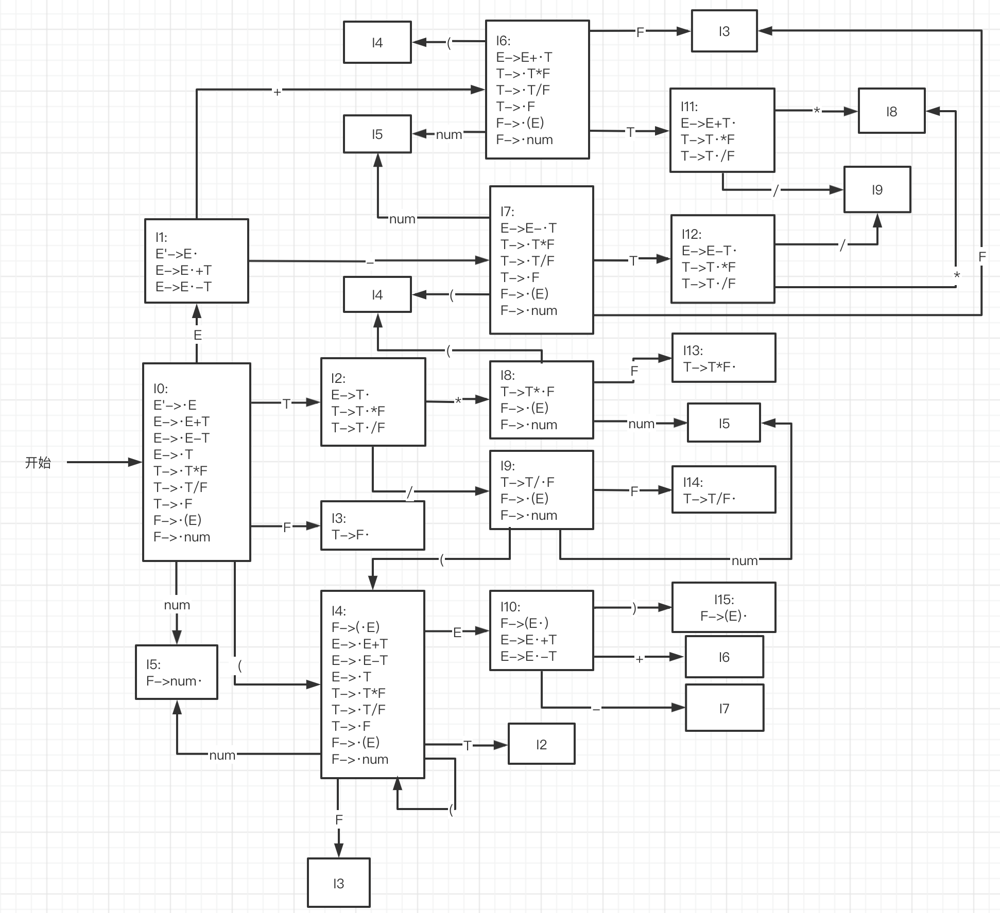

本文的前提：

编写语法分析程序，实现对算术表达式的语法分析。要求所分析算数表达式由如下的文法产生

> E->E+T | E-T | T
>
> T->T*F | T/F | F
>
> F-> (E) | num

实验要求：在对输人的算术表达式进行分析的过程中，依次输出所采用的产生式

编写算法分析程序实现自底向上的分析，要求如下

(1)构造识别该文法所有活前缀的DFA

(2)构造该文法的LR分析表

(3)编程实现算法4.3，构造LR分析程序

## 分析

首先，对于给出的文法，写出其拓广文法：

> (0) E'->E
> 
> (1) E->E+T
> 
>(2) E->E-T
>
> (3) E->T
>
> (4) T->T*F
>
> (5) T->T/F
>
> (6) T->F
>
> (7) F-> (E)
>
> (8) F->num

构造如下的识别该文法所有活前缀的DFA：

同时写出相应的FOLLOW集：

> follow(E') = { $ }
> 
> follow(E) = { +, -, ), $ }
>
> follow(T) = follow(F) = { *, /, +, -, ), $ }

然后，根据构造的DFA和FOLLOW集，可以填出对应的LR分析表：

状态 | action | goto
-- | + | - | * | / | ( | ) | num | $ | E | T | F
--|--|--|--|--|--|--|--|--|--|--|--
0 | | | | | s4 | | s5 | | 1 | 2 | 3
1 | s6 | s7 | | | | | | acc | | |
2 | r3 | r3 | s8 | s9 | | r3 | r3 | | |
3 | r6 | r6 | r6 | r6 | | r6 | | r6 | | |
4 | | | | | s4 | | s5 | | 10 | 2 | 3
5 | r8 | r8 | r8 | r8 | | r8 | | r8 | | |
6 | | | | | s4 | | s5 | | | 11 | 3
7 | | | | | s4 | | s5 | | | 12 | 3
8 | | | | | s4 | | s5 | | | | 13
9 | | | | | s4 | | s5 | | | | 14
10 | s6	| s7 |	| | | s15 | | | | |
11 | r1	| r1 | s8 | s9 | | r1 | | r1
12 | r2	| r2 | s8 | s9 | | r2 | | r2
13 | r4	| r4 | r4 | r4 | | r4 | | r4
14 | r5	| r5 | r5 | r5 | | r5 | | r5
15 | r7	| r7 | r7 | r7 | | r7 | | r7

